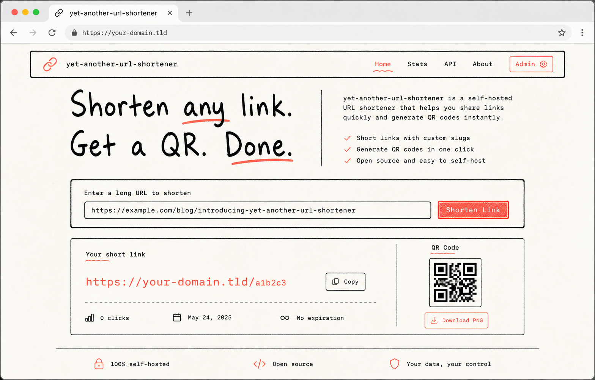
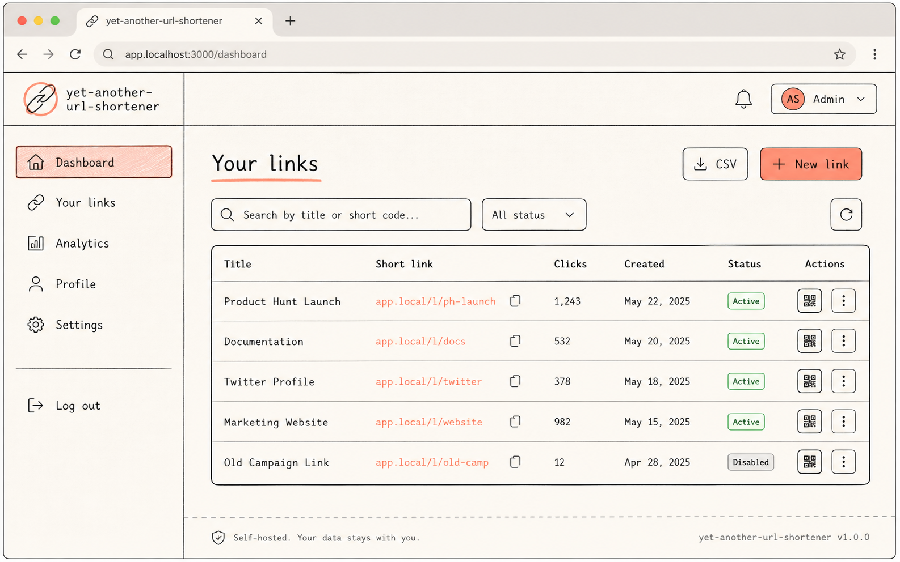
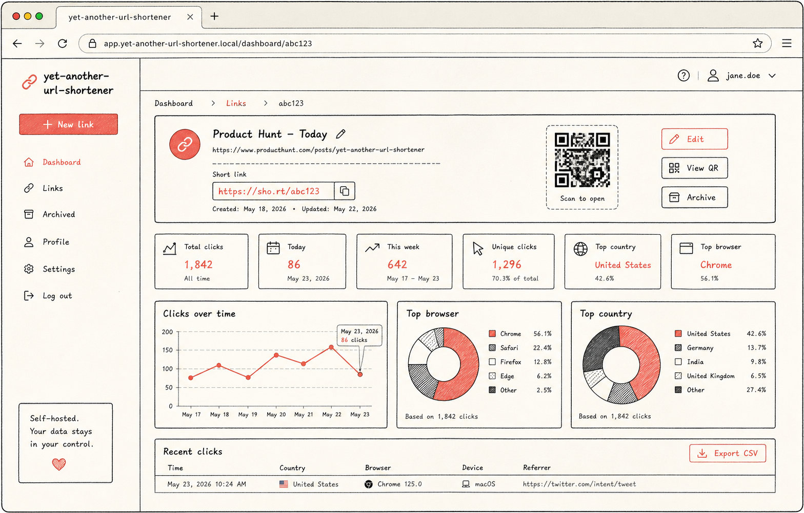

<div align="center">

# Yet Another URL Shortener

**A self-hosted link management tool with redirect analytics, QR codes, and a paper-wireframe UI.**  
Built as a full-stack TypeScript monorepo — NestJS API + Next.js frontend.

[](LICENSE)
[](https://nodejs.org)
[](https://nestjs.com)
[](https://nextjs.org)
[](https://www.postgresql.org)
[](https://redis.io)
[](https://www.docker.com)

[Features](#-features) · [Quick Start](#-quick-start) · [API](#-api) · [Deploy](#-production) · [Structure](#-project-structure)

<p>
  
  
  
</p>

</div>

---

## ✨ Features

### 🔗 Link Management

- Create short links with auto-generated 8-character slugs
- Edit destination URL or rename the slug at any time — 409 conflict guard included
- Archive links to keep the dashboard clean without breaking redirects
- Delete links permanently
- Search across slug and destination URL
- Filter by status (active / archived) and sort by date
- Export all links as a CSV file

### 📊 Analytics

- Click timeline — daily aggregation for the last 30 days
- Browser breakdown via `ua-parser-js`
- Country breakdown via `geoip-country`
- Real IP detection: `cf-connecting-ip` → `req.ip` → socket address

### 📷 QR Codes

- Instant PNG QR code for every short link
- Download-ready from the link detail page

### 🔐 Authentication

- Email + password registration and login
- Access token + refresh token stored in `httpOnly` cookies
- Token rotation on refresh
- Argon2 password hashing

### ⚡ Performance

- Redis cache-aside for redirect resolution (5 min TTL)
- Cache invalidation on slug or URL updates
- Async click recording — redirect never waits for DB write

---

## 🚀 Quick Start

### Prerequisites

- Node.js ≥ 24
- Docker

### 1. Install dependencies

```bash
npm install && npm install --prefix web
```

### 2. Configure environment

```bash
cp .env.sample .env
```

The defaults expect everything on localhost. Add one line for the frontend:

```bash
echo "NEXT_PUBLIC_API_URL=http://localhost:3000/v1" > web/.env.local
```

### 3. Start Postgres + Redis

```bash
npm run dev:db
```

### 4. Prepare the database

```bash
npm run db:push && npm run db:seed
```

### 5. Run

```bash
npm run dev
```

| Service  | URL                        |
| -------- | -------------------------- |
| Frontend | http://localhost:3001      |
| API      | http://localhost:3000      |
| API docs | http://localhost:3000/docs |

### Seed credentials

| Field    | Value           |
| -------- | --------------- |
| Email    | dev@example.com |
| Password | password123     |

The seed creates 30 links and 150 clicks spread across the last 30 days.

---

## 🛠️ Tech Stack

### API — `src/`

| Concern        | Library                                        |
| -------------- | ---------------------------------------------- |
| Framework      | NestJS 11                                      |
| ORM            | Prisma 7 (`@prisma/adapter-pg`)                |
| Database       | PostgreSQL                                     |
| Cache          | Redis via ioredis                              |
| Auth           | Passport + JWT, httpOnly cookies               |
| Passwords      | argon2                                         |
| Validation     | class-validator + class-transformer            |
| QR codes       | qrcode                                         |
| GeoIP          | geoip-country                                  |
| Browser parser | ua-parser-js                                   |
| Docs           | @nestjs/swagger + @scalar/nestjs-api-reference |

### Frontend — `web/`

| Concern      | Library                         |
| ------------ | ------------------------------- |
| Framework    | Next.js (App Router)            |
| Server state | TanStack Query v5               |
| Forms        | React Hook Form + Zod           |
| Charts       | Recharts                        |
| Styling      | Tailwind CSS 4                  |
| Components   | shadcn/ui + paper design system |

---

## 📡 API

All routes are versioned under `/v1`. Full interactive docs at `/docs`.

### Auth

| Method | Path              | Auth | Description                    |
| ------ | ----------------- | ---- | ------------------------------ |
| POST   | /v1/auth/register | —    | Register + set cookies         |
| POST   | /v1/auth/login    | —    | Login + set cookies            |
| POST   | /v1/auth/refresh  | —    | Rotate access + refresh tokens |
| POST   | /v1/auth/logout   | ✓    | Clear cookies                  |
| GET    | /v1/auth/me       | ✓    | Current user                   |

### Links

| Method | Path                | Auth | Description                             |
| ------ | ------------------- | ---- | --------------------------------------- |
| GET    | /v1/link            | ✓    | Paginated list (search / status / sort) |
| POST   | /v1/link            | ✓    | Create → returns short URL string       |
| PATCH  | /v1/link/:id        | ✓    | Update URL, slug, or archived state     |
| DELETE | /v1/link/:id        | ✓    | Delete permanently                      |
| GET    | /v1/link/export/csv | ✓    | Download all links as CSV               |
| GET    | /v1/link/:code      | ✓    | Get link data by slug                   |
| GET    | /v1/link/:code/qr   | ✓    | PNG QR code                             |

### Statistics

| Method | Path                               | Auth | Description          |
| ------ | ---------------------------------- | ---- | -------------------- |
| GET    | /v1/statistics/link/:code/browser  | ✓    | Browser breakdown    |
| GET    | /v1/statistics/link/:code/country  | ✓    | Country breakdown    |
| GET    | /v1/statistics/link/:code/timeline | ✓    | Daily click timeline |

### Public

| Method | Path     | Auth | Description                |
| ------ | -------- | ---- | -------------------------- |
| GET    | /l/:code | —    | Redirect (302) + log click |

> Mutations (`PATCH`, `DELETE`) use the link's `id` (UUID).  
> Public routes (`/l/:code`, QR, statistics) use the human-readable `code`.

---

## 🧪 Tests

```bash
npm test              # unit tests
npm run test:e2e      # e2e tests (no DB or Redis required)
npm run test:all      # both, sequentially
npm run test:cov      # with coverage report
```

E2E tests run against an in-memory store — no real infrastructure needed. Prisma and Redis are replaced by lightweight mock factories in `test/e2e/mocks/`.

---

## 🏗️ Production

The repo ships a `docker-compose.prod.yml` that bundles the API, Postgres, and Redis.

```bash
# Build everything
npm run build

# Start API stack (Docker — API + Postgres + Redis)
npm run prod:api

# Start frontend
npm run prod:web
```

Required environment variables:

```env
DATABASE_URL=
REDIS_HOST=
REDIS_PORT=
JWT_SECRET=
JWT_EXPIRATION_TIME=
JWT_REFRESH_EXPIRATION_TIME=
APP_URL=
COOKIE_DOMAIN=
NODE_ENV=production
```

---

## 📁 Project Structure

```
.
├── src/
│   ├── api/
│   │   ├── auth/           # register, login, logout, refresh, /me
│   │   ├── link/           # CRUD, redirect, QR, CSV export
│   │   ├── statistics/     # browser / country / timeline
│   │   └── user/           # internal user service
│   ├── common/
│   │   └── decorators/     # @Authorization @AuthorizedUser @ClientIp @UserAgent
│   ├── config/             # env constants
│   ├── infra/
│   │   ├── prisma/         # PrismaService
│   │   └── redis/          # RedisService (get / save / retrieve / del)
│   └── bootstrap/          # Swagger + Scalar setup
├── prisma/
│   ├── schema/             # split schema files (user, link, click)
│   └── seed.ts             # dev seed: 1 user, 30 links, 150 clicks
├── test/
│   └── e2e/
│       ├── mocks/          # prisma.mock.ts, redis.mock.ts, e2e-store.ts
│       └── helpers/        # createE2eApp, registerUser
└── web/
    └── src/
        ├── app/            # Next.js App Router pages
        ├── components/     # UI components
        ├── hooks/          # TanStack Query hooks
        └── services/       # typed API client (class-based)
```

---

## 📄 License

MIT
